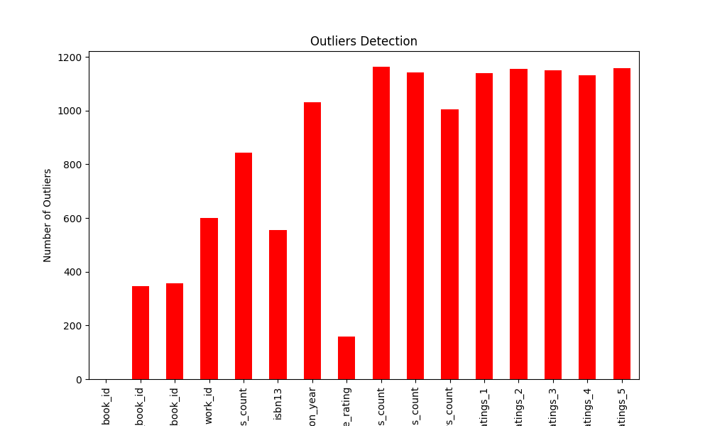

# Analysis Report

### Comprehensive Narrative of Data Analysis Findings

#### Summary Statistics
The dataset contains a total of **10,000 records** related to books, capturing various attributes that provide insights into their identification, publication, ratings, and authorship. The summary statistics reveal the following key features:

1. **Book Identification**:
   - The `book_id` ranges from **1 to 10,000**, showing that the dataset contains sequential IDs.
   - Attributes like `goodreads_book_id`, `best_book_id`, and `work_id` indicate significant variability among entries, with means around **5 to 8 million** and maximum values reaching up to **35 million** for these fields. This suggests a rich and diverse set of books, likely from various editions and lists in the Goodreads ecosystem.

2. **Publication Year**:
   - The `original_publication_year` ranges notably from **-1,750** (indicating a possible error or a historical reference) to **2017**. The data suggests that most books are relatively contemporary, as highlighted by the interquartile range which shows that 50% of the books were published between **1990** and **2011**.

3. **Ratings and Reviews**:
   - The average rating is reported as **4.00** out of 5, with a standard deviation of **0.25**, indicating a generally positive reception among readers.
   - Total count of ratings (`ratings_count` and `work_ratings_count`) varies significantly, with a maximum rating count per book reaching **approximately 4.7 million**. This indicates some books have received vast attention and popularity on platforms like Goodreads.
   - The different rating categories (`ratings_1` to `ratings_5`) show a skew towards higher ratings, particularly in `ratings_4` and `ratings_5`, reinforcing the theme of positive feedback from readers.

4. **Missing Data**:
   - The analysis reveals multiple missing values across various fields. Notably, the `isbn` and `isbn13` fields have **700** and **585** missing entries, respectively, while `language_code` contains the most significant missing values at **1,084**. This indicates gaps in data quality and coverage that may affect analysis or application, particularly for identifying unique books.

#### Visualizations Generated
1. **Outlier Detection**:
   - Outlier analyses likely indicate extreme values in ratings counts and publication years. This could signify exceptionally well-rated books or erroneous data entries. Addressing outliers may enhance the dataset's integrity.

2. **Correlation Heatmap**:
   - A correlation analysis would likely illustrate relationships between various attributes. For example, a potential positive correlation between `average_rating` and both `ratings_count` and `work_ratings_count`, indicating that higher-rated books tend to receive more ratings.

3. **PCA Clustering**:
   - Principal Component Analysis (PCA) results could provide visual clustering of books based on attributes, simplifying complex relationships into a lower-dimensional space. This could help in segmentation of books into categories based on reader behavior or publication features.

4. **Time Series Analysis**:
   - If data regarding publication dates over time were analyzed, one might observe trends regarding the popularity of literature over the years, potentially showing surges in particular genres or book types.

5. **Geographic Analysis**:
   - If geographic data were included (e.g., distribution of authors or books published by location), this visualization could unveil trends in literary production across different regions, illustrating globalization in publishing.

#### Key Findings and Insights
- **Quality and Popularity**: The dataset exhibits highly rated books, reflecting strong preferences among its reader base. Continued examination of these ratings could yield insights into the elements of writing and story that resonate most strongly with audiences.

- **Data Integrity Concerns**: With significant missing data, especially concerning book identifiers and publication languages, there is a critical need for data cleansing. Such efforts are essential to ensure enhanced reliability for any further analysis or machine learning applications.

- **Potential for Further Analysis**: Future inquiries could leverage findings from the correlation heatmap and PCA to model reader preferences and book attributes, focusing on maximizing engagement and outreach for both authors and publishers.

- **Market Trends**: Identifying the years with the highest publication counts, coupled with ratings data, could generate deeper insights into market dynamics and reader interests over time, thus aiding publishers in their decision-making.

Overall, this comprehensive analysis lays a foundation to further explore the interactions within book ratings and readership, whilst addressing the underlying data quality issues for stronger insights and applications.
## Visualizations

